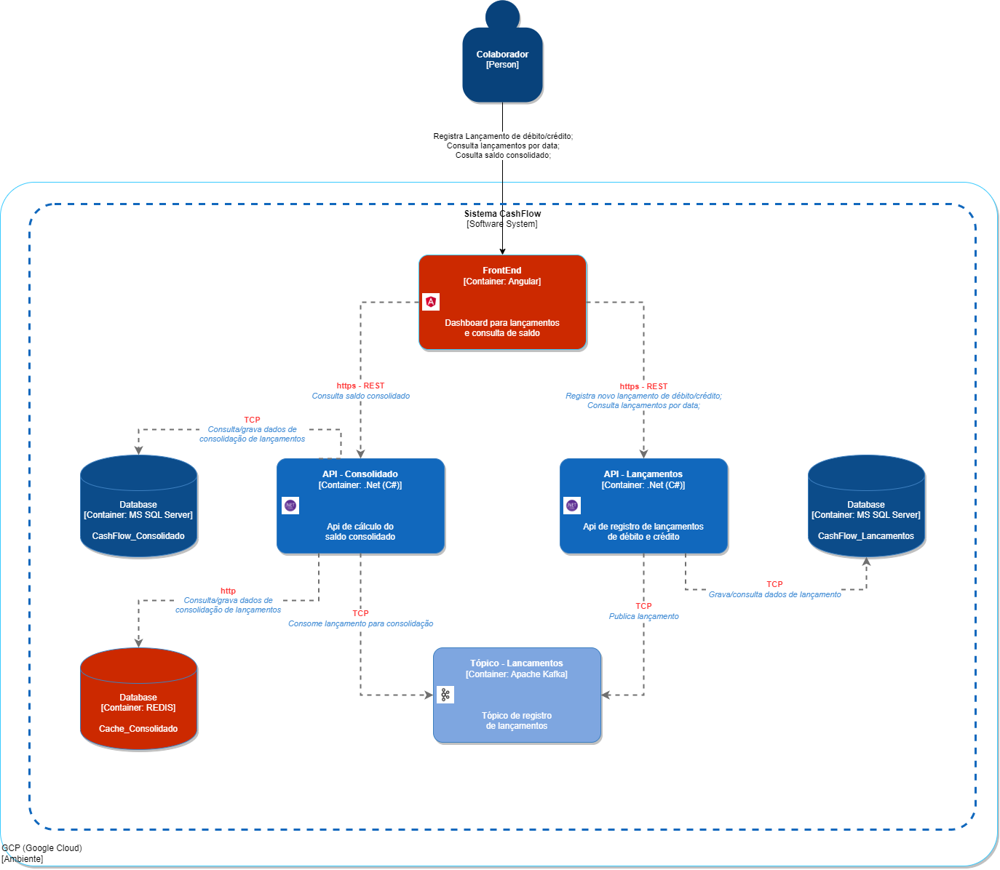

# 💰 CashFlow — Controle de Fluxo de Caixa

Sistema de controle de fluxo de caixa diário com microsserviços independentes para registro de lançamentos e consolidação diária de saldos.

---

## 📋 Sumário

- [Visão Geral](#visão-geral)
- [Arquitetura](#arquitetura)
- [Decisões Técnicas](#decisões-técnicas)
- [Pré-requisitos](#pré-requisitos)
- [Como Rodar Localmente](#como-rodar-localmente)
- [Endpoints da API](#endpoints-da-api)
- [Testes](#testes)
- [Observabilidade](#observabilidade)
- [Infraestrutura GCP](#infraestrutura-gcp)
- [Evoluções Futuras](#evoluções-futuras)

---

## Visão Geral

Um comerciante precisa controlar seu fluxo de caixa diário com lançamentos de débitos e créditos, além de um relatório que disponibilize o saldo diário consolidado.

### Levantamento de Domínios e Requisitos de Negócio 
**Domínios de Negócio:** 
Para solução à demanda apresentada, será criado o domínio de Gestão Financeira, com dois produtos (Lançamento e Consolidado Diário): 

| Produto | Tipo | Resposabilidade |
|---|---|---|
| Lançamentos | Core Domain | Registrar débitos e créditos |
| Consolidado Diário | Support Domain | Agregar saldo por dia |

**Requisitos de Negócio**

Lançamentos:
- Registrar um lançamento (débito ou crédito) 
- Consultar lançamentos por período
- Validar regras de negócio (valor > 0, tipo válido, data válida, descrição obrigatória) 


Consolidado Diário:
- Calcular saldo consolidado do dia
- Disponibilizar relatório de saldo por data
- Processar eventos de lançamento de forma assíncrona 

**Requisitos Funcionais**
- O sistema deve permitir registrar lançamentos do tipo débito ou crédito com valor, descrição e data e meio de lançamento (dinheiro, pix, cartão);
- O sistema deve retornar a lista de lançamentos por data;
- O sistema deve disponibilizar o saldo consolidado de um dia específico;
- O consolidado deve ser atualizado automaticamente a cada novo lançamento registrado;
- Não é requisito permitir a exclusão de lançamentos. 

**Requisitos Não-Funcionais**
| Requisitos | Meta |
|---|---|
| Disponibilidade do serviço de lançamentos | 99,9% (independente do consolidado) |
| Throughput do consolidado | 50 req/s |
| Tolerância a perda no consolidado | ≤ 5% |
| Latência do lançamento | < 200ms p99 |
| Consistência do consolidado | Eventual |
| Segurança  | Autenticação JWT em todos os endpoints |

**Descisão arquitetural**

Por que microsserviços? 


Por que Event-Driven? 


Por que não monolito? 
- A queda de um serviço implicaria em derrubar o outro n]ao atendendo assim aos requisitos levantados.

O sistema é composto por **dois microsserviços independentes**:

| Serviço | Responsabilidade | Porta |
|---|---|---|
| `Lancamentos.Api` | Registrar e consultar lançamentos (débitos/créditos) | 8080 |
| `Consolidado.Api` | Calcular e disponibilizar o saldo consolidado por dia | 8081 |

**Princípio de isolamento:** o serviço de lançamentos **nunca** fica indisponível por causa do consolidado. A comunicação entre eles é 100% assíncrona via mensageria.

---

## Arquitetura



```
┌─────────────┐                    ┌──────────────────┐
│   Clientes  │ ─────────────────► │     FronEnd      │
└─────────────┘                    │    (Angular)     │
                                   └────────┬─────────┘
                                            │  HTTPS/JWT
                                   ┌──────────────────┐
                                   │   API Gateway    │
                                   │  + Cloud Armor   │
                                   └────────┬─────────┘
                                            │
                                            │
                      ┌─────────────────────┴──────────────────────┐
                      │                                            │
               ┌──────▼──────┐                            ┌────────▼───────┐
               │ Lançamentos │                            │  Consolidado   │
               │   API       │                            │     API        │
               │ (.NET 8)    │                            │  (.NET 8)      │
               └──────┬──────┘                            └───────┬────────┘
                      │                                           │
                      │  Publica evento                           │ Consome evento
                      │  (assíncrono)                             │ (BackgroundService)
                      │                                           │
                      └──────────►   Kafka       ◄────────────────┘
                                       │
                      ┌────────────────┼────────────────┐
                      │                │                │
               ┌──────▼──────┐  ┌──────▼─────┐  ┌───────▼─────┐
               │  Cloud SQL  │  │ Cloud SQL  │  │  Redis      │
               │ (Lanç. DB)  │  │ (Cons. DB) │  │  (Cache)    │
               └─────────────┘  └────────────┘  └─────────────┘
```

### Fluxo de dados

1. Cliente envia `POST /api/lancamentos` com JWT
2. API valida, persiste no banco e publica evento `LancamentoRegistrado` no Tópico Kafka
3. Retorna `202 Accepted` imediatamente — **independente do estado do consolidado**
4. Serviço de Consolidado consome o evento como `BackgroundService`
5. Atualiza saldo diário e invalida o cache Redis
6. `GET /api/consolidado/{data}` → Redis hit em < 5ms na maioria dos casos

---

## Decisões Técnicas

### Por que Microsserviços?
- Isolamento de falhas (serviços rodando independentes não gerando acoplamento entre eles)
- Escalabilidade independente por serviço
- Deploy independente 

### Por que Event-Driven?
- Lançamento publica evento → Consolidado consome quando disponível
- Desacoplamento total entre os dois serviços
- Naturalmente resiliente a quedas 

### Por que Cloud Run?
- Auto-scaling transparente de 0 a N instâncias
- Suporta picos de 50 req/s no consolidado sem configuração de cluster
- Pay-per-use — sem custo em horários ociosos
- Deploy via container sem gerenciar infraestrutura

### Por que Redis (Cache-aside)?
- Absorve os 50 req/s de pico no consolidado sem bater no banco a cada requisição.
- TTL de 5 minutos equilibra consistência eventual com performance.
- Falha no Redis degrada graciosamente para o banco — nunca derruba a API.

### Por que Clean Architecture?
- Regras de negócio isoladas no `Domain` — sem dependência de frameworks
- Use cases testáveis sem infraestrutura real (mocks via NSubstitute)
- Fácil substituição de banco, cache ou mensageria sem alterar o domínio

### Por que CQRS com MediatR?
- Separa intenção de escrita (`RegistrarLancamentoCommand`) de leitura (`ListarLancamentosQuery`)
- Cada handler tem responsabilidade única
- Facilita evolução independente de leitura e escrita
- Implementa separadmente regras de negócio

### Por que dois bancos de dados separados?
- Cada microsserviço é dono dos seus dados (Database per Service pattern)
- Schema pode evoluir independentemente
- Falha em um banco não afeta o outro

---

## Pré-requisitos

- [Docker](https://www.docker.com/) 24+
- [Docker Compose](https://docs.docker.com/compose/) v2+
- [.NET SDK 10.0](https://dotnet.microsoft.com/download/dotnet/10.0) (para rodar testes localmente)

---

## Como Rodar Localmente

### 1. Clone o repositório

```bash
git clone https://github.com/Mardarc08/CashFlow_Verx.git
cd Cashflow_Verx
```

### 2. Suba toda a infraestrutura com Docker Compose

```bash
docker compose up --build -d
```

Isso sobe automaticamente:
- SQLServer (porta 5433)
- Redis (porta 6379)
- Kafka (porta 9092)
- API de Lançamentos (porta 8080)
- API de Consolidado (porta 8081)
- FrontEnd (porta 4200)

Aguarde as mensagens de saúde dos containers antes de fazer requisições:
```
cashflow-lancamentos  | Application started. Press Ctrl+C to shut down.
cashflow-consolidado  | Application started. Press Ctrl+C to shut down.
```

### 3. Gerar um token JWT para os testes

Como é um ambiente de dev, você pode gerar um token com qualquer ferramenta JWT usando:
- **Key:** `cashflow2026TesteVerx_Consultoria`
- **Issuer:** `cashflow-api`
- **Audience:** `cashflow-clients`

Ou use o site https://jwt.io com o algoritmo HS256 e o payload:
```json
{
  "sub": "usuario-teste",
  "iss": "cashflow-api",
  "aud": "cashflow-clients",
  "exp": 9999999999
}
```

### 4. Acesse o Swagger

| Serviço | URL |
|---|---|
| Lançamentos | http://localhost:8080/swagger |
| Consolidado | http://localhost:8081/swagger |

### 5. Acesse o frontEnd

| Serviço | URL |
|---|---|
| Cashflow_dashboard | http://localhost:4200/ |

**obs:** Para realização de teste inicial, a chave para geração de token foi imputada no código.
---

## Endpoints da API

### Lançamentos — `http://localhost:8080`

#### `POST /api/lancamentos`
Registra um novo lançamento.

**Headers:**
```
Authorization: Bearer {seu-token-jwt}
Content-Type: application/json
```

**Body:**
```json
{
  "valor": 150.00,
  "tipo": 2,
  "descricao": "Venda à vista",
  "data": "2025-01-15"
}
```

> `tipo`: `1` = Débito, `2` = Crédito

**Resposta 201 Created:**
```json
{
  "id": "3fa85f64-5717-4562-b3fc-2c963f66afa6",
  "criadoEm": "2025-01-15T14:30:00Z"
}
```

---

#### `GET /api/lancamentos?data=2025-01-15`
Lista todos os lançamentos de uma data.

**Resposta 200 OK:**
```json
[
  {
    "id": "3fa85f64-5717-4562-b3fc-2c963f66afa6",
    "valor": 150.00,
    "tipo": 2,
    "tipoDescricao": "Credito",
    "descricao": "Venda à vista",
    "data": "2025-01-15",
    "criadoEm": "2025-01-15T14:30:00Z"
  }
]
```

---

### Consolidado — `http://localhost:8081`

#### `GET /api/consolidado/{data}`
Retorna o saldo consolidado de um dia.

**Exemplo:** `GET /api/consolidado/2025-01-15`

**Resposta 200 OK:**
```json
{
  "data": "2025-01-15",
  "totalCreditos": 1500.00,
  "totalDebitos": 300.00,
  "saldoFinal": 1200.00,
  "atualizadoEm": "2025-01-15T18:00:00Z"
}
```

**Resposta 404 Not Found** (nenhum lançamento no dia):
```json
{
  "message": "Nenhum consolidado encontrado para 2025-01-15."
}
```

---

### Health Checks

```
GET http://localhost:8080/health  → Lançamentos + PostgreSQL
GET http://localhost:8081/health  → Consolidado + PostgreSQL + Redis
```

---

## Testes

### Rodar todos os testes

```bash
dotnet test
```

### Rodar por projeto

```bash
# Testes de Lançamentos
dotnet test tests/CashFlow.Lancamentos.Tests/

# Testes de Consolidado
dotnet test tests/CashFlow.Consolidado.Tests/
```

### Cobertura de testes

```bash
dotnet test --collect:"XPlat Code Coverage"
```

### O que é testado

**Lançamentos (Unit):**
- Registro com dados válidos persiste e publica evento
- Valor zero/negativo lança `ValidationException`
- Descrição vazia lança `ValidationException`
- Data futura lança `ValidationException`
- Falha no Pub/Sub não propaga erro (resiliência)
- Entidade de domínio cria IDs únicos

**Consolidado (Unit):**
- Cache hit não consulta o banco
- Cache miss busca no banco e popula cache
- Consolidado inexistente retorna null (404)
- AplicarCredito soma corretamente
- AplicarDebito subtrai corretamente do saldo

---

## Observabilidade

### Métricas e Logs (GCP)

No ambiente GCP, o sistema utiliza:

- **Cloud Monitoring** — métricas de latência, throughput e taxa de erro por serviço
- **Cloud Logging** — logs estruturados em JSON com correlação por `TraceId`
- **Cloud Trace** — rastreamento distribuído entre serviços

### Alertas recomendados

| Alerta | Condição | Ação |
|---|---|---|
| Alta latência Lançamentos | p99 > 500ms por 5min | Escalar instâncias |
| Taxa de erro > 1% | 5xx por 5min | Notificar on-call |
| Dead Letter Topic com mensagens | DLQ > 0 | Investigar consumer |
| Cache miss rate > 80% | Redis miss/total | Verificar TTL / Redis |

### Logs estruturados (exemplo)

```json
{
  "timestamp": "2025-01-15T14:30:00Z",
  "level": "Information",
  "message": "Lançamento {Id} registrado com sucesso.",
  "Id": "3fa85f64-5717-4562-b3fc-2c963f66afa6",
  "traceId": "abc123",
  "service": "lancamentos-api"
}
```

---

## Infraestrutura GCP

Os recursos são provisionados via **Terraform** na pasta `/infra`.

### Recursos criados

| Recurso | Produto GCP | Finalidade |
|---|---|---|
| API de Lançamentos | Cloud Run | Microsserviço stateless com auto-scale |
| API de Consolidado | Cloud Run | Microsserviço stateless com auto-scale |
| Banco Lançamentos | Cloud SQL (PostgreSQL 16) | Persistência com HA e failover |
| Banco Consolidado | Cloud SQL (PostgreSQL 16) | Persistência isolada |
| Cache | Memorystore (Redis 7) | Cache de consolidado |
| Mensageria | Cloud Pub/Sub | Comunicação assíncrona |
| Gateway | Cloud Endpoints / Apigee | Rate limit, auth, roteamento |
| Firewall | Cloud Armor | WAF, proteção DDoS |
| Imagens | Artifact Registry | Docker images |
| CI/CD | Cloud Build | Pipeline automatizado |
| Segredos | Secret Manager | Chaves JWT, strings de conexão |

### Deploy no GCP

```bash
# 1. Autentique no GCP
gcloud auth login
gcloud config set project seu-projeto-gcp

# 2. Provisione a infraestrutura
cd infra
terraform init
terraform plan
terraform apply

# 3. Build e push das imagens
gcloud builds submit --config=cloudbuild.yaml

# 4. Deploy no Cloud Run (feito automaticamente pelo Cloud Build)
```

---

## Evoluções Futuras

### Funcionalidades
- **Autenticação completa** — endpoint de login com geração de JWT e refresh token
- **Multi-tenant** — suporte a múltiplos comerciantes com isolamento por tenant
- **Categorias de lançamento** — classificação por tipo (alimentação, fornecedor, etc.)
- **Relatórios por período** — consolidado semanal e mensal além do diário
- **Webhooks** — notificações quando o saldo diário atingir limites configurados

### Técnicas
- **Idempotência no consumer** — deduplificação por `LancamentoId` para evitar dupla contagem em reprocessamentos
- **Circuit Breaker** — Polly com circuit breaker no acesso ao Redis e ao banco
- **Migrations automáticas via CI/CD** — rodar migrations como job separado no pipeline, não em startup
- **Testes de integração** — usar Testcontainers para subir PostgreSQL e Redis reais nos testes
- **OpenTelemetry** — instrumentação padronizada para traces e métricas exportados para o GCP

